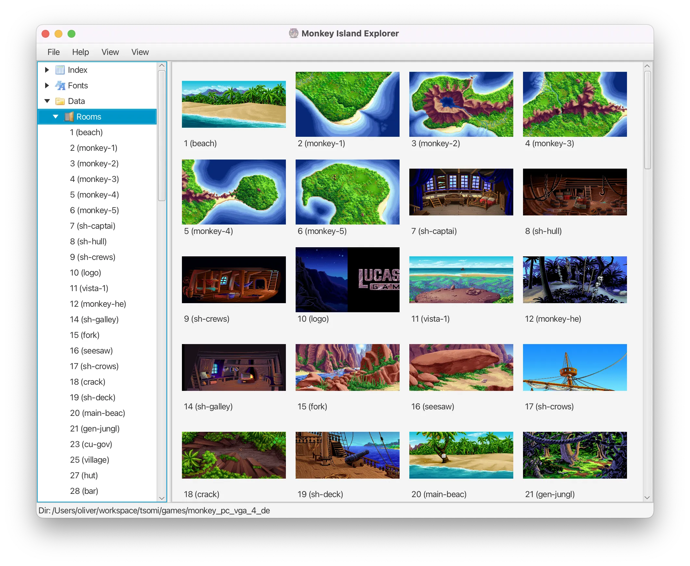
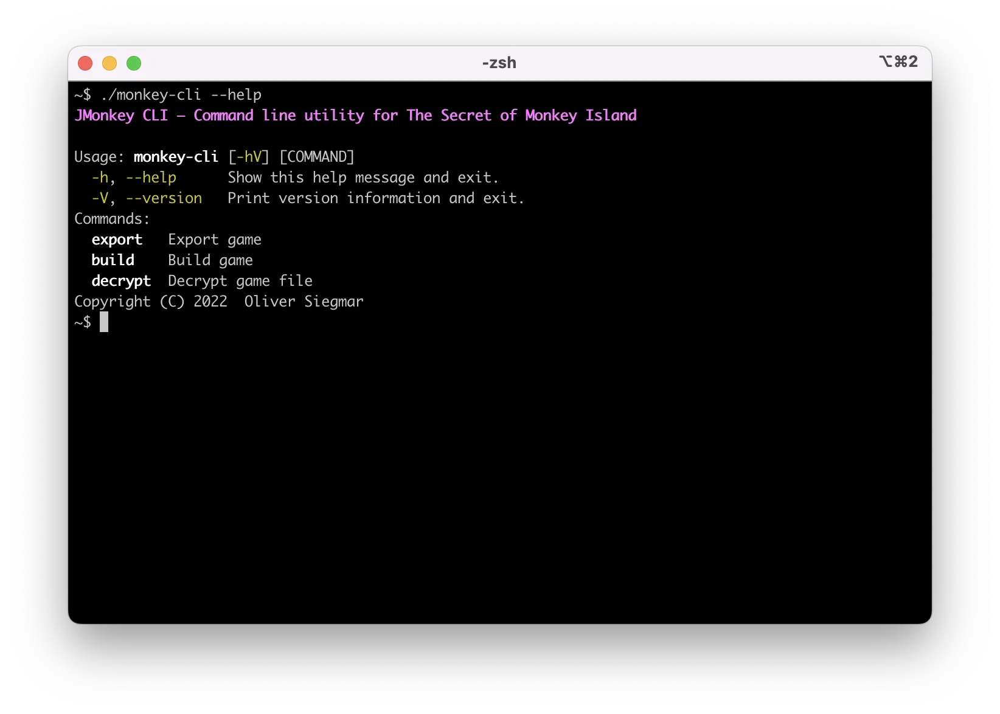

# JMonkey

[](https://github.com/osiegmar/jmonkey/actions/workflows/gradle.yml)

This Java based project is a development kit for the classic computer adventure game
[The Secret of Monkey Island](https://en.wikipedia.org/wiki/The_Secret_of_Monkey_Island)
created by Ron Gilbert, © 1990 LucasArts Entertainment Company.

The motivation for this fan project was fun, nostalgia and education.

> :warning: This project does currently not allow to actually **PLAY** the game!

## Requirements

* Java 17 to build and run
* A licensed copy of the original game files
  (currently only the **floppy disk** versions for PC, Amiga and Atari ST are supported).

## Use

To launch the Monkey Island Explorer, run:
```sh
./gradlew explorer:run
```



To use the Command Line Interface, run:

```sh
./gradlew cli:installDist
cd cli/build/install/monkey-cli
./monkey-cli
```



## Documentation

See [Technical internals](https://osiegmar.github.io/jmonkey/).

## License & Credits

This project wouldn't have been possible without the great work from others – especially
from [ScummVM](https://scummvm.org).
Hence, this project is licensed under the GNU General Public License v3 or later – the same license ScummVM uses.

---

LucasArts, Monkey Island and probably lots of other things are registered trademarks of
[LucasArts, Inc.](http://www.lucasarts.com/). This project is not affiliated in any way with LucasArts, Inc.
